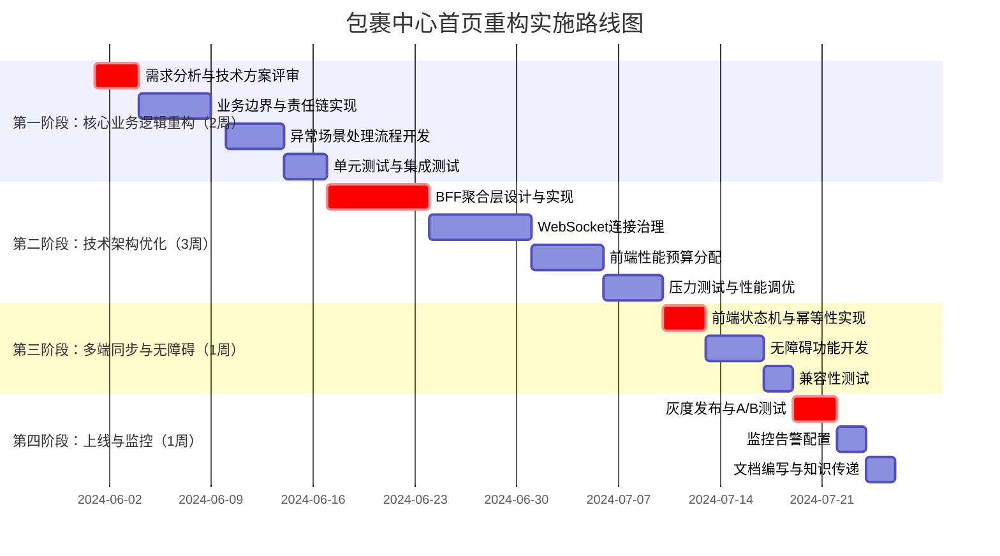

# 校园快递配送系统 - 包裹中心(首页)重构方案

## 一、业务逻辑重构：严密的业务边界与责任链

### 1.1 包裹聚合与责任分离机制

```typescript
/**
 * 包裹聚合服务 - 明确业务边界
 */
class PackageAggregationService {
  /**
   * 定义可合并包裹的业务规则
   */
  private static readonly MERGE_RULES = {
    // 必须满足所有条件才能合并
    MANDATORY: {
      sameStation: true,         // 同一驿站
      sameRecipient: true,       // 同一收件人
      sameStatus: 'INCOMING',    // 同为待取件状态
      sameCarrier: false,        // 快递公司可以不同
      sameShelfZone: true        // 同一货架区域
    },
    // 推荐合并的条件（满足任意一个）
    RECOMMENDED: {
      sameDeliveryTimeWindow: true,  // 配送时间段相同
      sameCourierAssignment: true,   // 同一配送员
      proximityDistance: 50          // 位置相近50米内
    }
  };

  /**
   * 检查包裹合并的合法性
   */
  async validateMergeEligibility(packageIds: string[]): Promise<MergeValidationResult> {
    const packages = await this.fetchPackageDetails(packageIds);
    
    // 1. 基础合法性校验
    const validationResult = {
      eligible: true,
      violations: [] as string[],
      recommended: false,
      liabilitySegments: [] as LiabilitySegment[],
      operationConstraints: [] as OperationConstraint[]
    };

    // 检查强制规则
    if (!this.checkMandatoryRules(packages)) {
      validationResult.eligible = false;
      validationResult.violations.push('包裹不满足强制合并条件');
    }

    // 检查推荐条件
    if (this.checkRecommendedRules(packages)) {
      validationResult.recommended = true;
    }

    // 2. 责任链拆分定义
    validationResult.liabilitySegments = this.defineLiabilitySegments(packages);
    
    // 3. 操作约束定义
    validationResult.operationConstraints = this.defineOperationConstraints(packages);
    
    return validationResult;
  }

  /**
   * 定义责任链段（每个包裹独立责任）
   */
  private defineLiabilitySegments(packages: Package[]): LiabilitySegment[] {
    return packages.map(pkg => ({
      packageId: pkg.id,
      trackingNumber: pkg.trackingNumber,
      carrier: pkg.carrier,
      station: pkg.station,
      liabilityOwner: this.determineLiabilityOwner(pkg),
      insuranceCoverage: pkg.insuranceAmount,
      exceptionScenarios: this.defineExceptionScenarios(pkg)
    }));
  }

  /**
   * 确定责任主体
   */
  private determineLiabilityOwner(pkg: Package): LiabilityOwner {
    const status = pkg.status;
    
    if (status === 'INCOMING') {
      return {
        type: 'STATION',
        id: pkg.station.id,
        name: pkg.station.name,
        contact: pkg.station.contact
      };
    } else if (status === 'DELIVERING') {
      return {
        type: 'COURIER',
        id: pkg.courier.id,
        name: pkg.courier.name,
        phone: pkg.courier.phone
      };
    } else if (status === 'DELIVERED') {
      return {
        type: 'RECIPIENT',
        id: pkg.recipient.id,
        name: pkg.recipient.name
      };
    }
    
    return { type: 'SYSTEM', id: 'system', name: '系统' };
  }

  /**
   * 定义异常场景处理逻辑
   */
  private defineExceptionScenarios(pkg: Package): ExceptionScenario[] {
    return [
      {
        type: 'PARTIAL_PICKUP',
        description: '合并取件时部分包裹异常',
        handlingProcedure: `
          1. 标记异常包裹状态为"异常-待处理"
          2. 生成独立取件码供用户单独取件
          3. 通知驿站管理员检查包裹
          4. 记录异常日志，启动调查流程
        `,
        compensationRule: '按异常包裹价值进行补偿'
      },
      {
        type: 'PACKAGE_MISMATCH',
        description: '包裹信息不匹配',
        handlingProcedure: `
          1. 暂停合并取件操作
          2. 显示具体不匹配的字段
          3. 提供手动验证选项
          4. 必要时退回人工处理
        `
      }
    ];
  }

  /**
   * 合并取件操作的完整业务流程
   */
  async executeMergedPickup(
    packageIds: string[], 
    userId: string
  ): Promise<MergedPickupResult> {
    const transactionId = this.generateTransactionId();
    
    try {
      // 1. 获取分布式锁，防止并发操作
      const lock = await this.acquireDistributedLock(`merged_pickup:${userId}`);
      if (!lock) {
        throw new BusinessException('系统繁忙，请稍后重试');
      }

      try {
        // 2. 验证合并条件
        const validation = await this.validateMergeEligibility(packageIds);
        if (!validation.eligible) {
          throw new BusinessException(`包裹不可合并: ${validation.violations.join(', ')}`);
        }

        // 3. 创建合并取件事务
        const transaction = await this.createMergedPickupTransaction(
          transactionId,
          packageIds,
          userId,
          validation.liabilitySegments
        );

        // 4. 生成独立的取件码（每个包裹一个）
        const pickupCodes = await this.generateIndividualPickupCodes(
          packageIds,
          transactionId
        );

        // 5. 通知驿站准备包裹
        await this.notifyStationForBatchPickup(
          packageIds,
          pickupCodes,
          validation.operationConstraints
        );

        // 6. 返回结果
        return {
          success: true,
          transactionId,
          pickupCodes,
          instructions: this.generatePickupInstructions(validation),
          liabilities: validation.liabilitySegments,
          estimatedTime: this.calculateEstimatedPickupTime(packageIds)
        };

      } finally {
        await lock.release();
      }
    } catch (error) {
      // 7. 事务回滚与补偿
      await this.rollbackMergedPickup(transactionId, error);
      
      return {
        success: false,
        error: error.message,
        transactionId,
        fallbackAction: this.getFallbackAction(packageIds)
      };
    }
  }

  /**
   * 降级策略：合并失败时的回退方案
   */
  private getFallbackAction(packageIds: string[]): FallbackAction {
    return {
      type: 'SEQUENTIAL_PICKUP',
      description: '由于系统限制，建议您按顺序取件',
      steps: packageIds.map((id, index) => ({
        packageId: id,
        step: index + 1,
        recommendedTimeWindow: this.calculateTimeWindow(index)
      })),
      totalEstimatedTime: this.calculateSequentialTime(packageIds)
    };
  }
}
```

### 1.2 实时追踪地图：心理预期管理与性能优化

```typescript
/**
 * 智能地图组件 - 按需加载与状态管理
 */
class IntelligentMapComponent {
  private mapInstance: Map | null = null;
  private isMapLoaded = false;
  private locationUpdates: LocationUpdate[] = [];
  private updateInterval: NodeJS.Timeout | null = null;
  private readonly LOCATION_UPDATE_THRESHOLD = 50; // 50米内不更新

  /**
   * 地图加载决策逻辑
   */
  shouldLoadMap(packageStatus: PackageStatus, userContext: UserContext): boolean {
    const rules = [
      // 规则1：仅在配送中且用户主动请求时加载
      {
        condition: packageStatus === 'DELIVERING' && userContext.mapPreference === 'auto',
        weight: 0.9
      },
      // 规则2：用户手动点击"查看位置"时加载
      {
        condition: userContext.action === 'view_location',
        weight: 1.0
      },
      // 规则3：包裹在驿站内超过1小时，不主动加载地图
      {
        condition: this.isPackageInStationTooLong(packageStatus),
        weight: 0.1
      },
      // 规则4：网络环境较差时，不加载动态地图
      {
        condition: userContext.networkQuality < 0.3,
        weight: 0.2
      }
    ];

    const totalWeight = rules.reduce((sum, rule) => {
      return rule.condition ? sum + rule.weight : sum;
    }, 0);

    return totalWeight > 0.5;
  }

  /**
   * 按需加载地图
   */
  async loadMapOnDemand(containerId: string, config: MapConfig): Promise<void> {
    if (this.isMapLoaded) return;

    // 显示加载占位符
    this.showMapPlaceholder(containerId, config.placeholderType);

    // 动态导入地图库
    const MapModule = await import(/* webpackChunkName: "campus-map" */ './campus-map');
    this.mapInstance = new MapModule.CampusMap(containerId, {
      ...config,
      // 性能优化配置
      maxZoom: 18,
      minZoom: 15,
      tileCacheSize: 50,
      renderFrameLimit: 30 // 限制30fps
    });

    this.isMapLoaded = true;
    
    // 预加载关键区域的瓦片
    this.preloadCriticalTiles(config.criticalAreas);
  }

  /**
   * 位置更新智能过滤
   */
  updateCourierLocation(location: CourierLocation): void {
    // 检查位置是否有效
    if (!this.isValidLocation(location)) {
      this.logLocationError(location);
      return;
    }

    // 防抖：避免频繁更新
    const lastUpdate = this.locationUpdates[this.locationUpdates.length - 1];
    if (lastUpdate) {
      const distance = this.calculateDistance(lastUpdate, location);
      
      // 规则1：50米内不更新，减少地图重绘
      if (distance < this.LOCATION_UPDATE_THRESHOLD) {
        return;
      }
      
      // 规则2：速度异常检查（防漂移）
      const timeDiff = location.timestamp - lastUpdate.timestamp;
      const speed = distance / (timeDiff / 1000);
      
      if (speed > 30) { // 超过30m/s（108km/h）视为异常
        this.smoothLocationTransition(lastUpdate, location);
        return;
      }
    }

    // 添加到更新队列
    this.locationUpdates.push(location);
    
    // 限制队列长度，防止内存泄漏
    if (this.locationUpdates.length > 100) {
      this.locationUpdates.shift();
    }

    // 更新地图显示
    this.updateMapMarker(location);
  }

  /**
   * 位置平滑过渡算法
   */
  private smoothLocationTransition(
    from: LocationUpdate, 
    to: LocationUpdate
  ): void {
    const steps = 10;
    const stepDuration = 100; // 每步100ms
    
    for (let i = 1; i <= steps; i++) {
      setTimeout(() => {
        const interpolated = this.interpolateLocation(from, to, i / steps);
        this.updateMapMarker(interpolated);
      }, i * stepDuration);
    }
  }

  /**
   * 弱网络环境处理
   */
  handlePoorNetworkCondition(): void {
    // 降级为静态地图
    if (this.mapInstance) {
      this.mapInstance.disableAnimations();
      this.mapInstance.useLowQualityTiles();
    }

    // 显示网络状态提示
    this.showNetworkWarning();
    
    // 延长更新间隔
    if (this.updateInterval) {
      clearInterval(this.updateInterval);
    }
    
    this.updateInterval = setInterval(() => {
      this.fetchLocationUpdate();
    }, 10000); // 10秒更新一次
  }

  /**
   * 静态地图替代方案
   */
  showStaticMapAlternative(packageInfo: Package): void {
    const staticMapUrl = this.generateStaticMapUrl({
      center: packageInfo.station.location,
      zoom: 16,
      markers: [{
        location: packageInfo.station.location,
        label: packageInfo.station.name
      }],
      size: '600x400',
      format: 'webp'
    });

    // 显示静态地图
    this.renderStaticMap(staticMapUrl);
    
    // 添加交互层
    this.addInteractiveOverlay([
      {
        type: 'info',
        content: `包裹位于: ${packageInfo.station.name}`,
        position: 'top-right'
      },
      {
        type: 'action',
        content: '查看配送路线',
        onClick: () => this.showDeliveryRoute(packageInfo)
      }
    ]);
  }
}
```

### 1.3 成就系统：正向激励设计

```typescript
/**
 * 正向成就系统 - 避免负向激励
 */
class PositiveAchievementSystem {
  private readonly ACHIEVEMENT_CONFIG = {
    // 可控成就：用户完全控制
    CONTROLLABLE: {
      'first_pickup': {
        condition: '完成首次取件',
        trigger: 'user_action',
        weight: 1.0,
        avoidNegative: true
      },
      'use_scheduled_delivery': {
        condition: '使用预约配送服务',
        trigger: 'user_action', 
        weight: 0.8
      },
      'share_experience': {
        condition: '分享使用体验',
        trigger: 'user_action',
        weight: 0.6
      }
    },
    // 累积成就：与用户努力相关
    ACCUMULATIVE: {
      'pickup_streak': {
        condition: '连续取件{count}天',
        trigger: 'consecutive_days',
        weight: 0.7,
        maxDays: 30 // 上限防止无限追求
      },
      'efficiency_master': {
        condition: '平均取件时间<3分钟',
        trigger: 'average_pickup_time',
        weight: 0.5,
        requireSamples: 10 // 需要足够样本
      }
    },
    // 排除条件：可能产生负向激励的场景
    EXCLUSIONS: [
      'peak_hour_pickup',      // 避免高峰期取件压力
      'zero_wait_time',        // 零等待时间不现实
      'perfect_attendance'     // 全勤可能造成压力
    ]
  };

  /**
   * 检查成就解锁条件
   */
  async checkAchievementEligibility(
    userId: string, 
    achievementId: string
  ): Promise<AchievementCheckResult> {
    const config = this.ACHIEVEMENT_CONFIG;
    const achievement = this.findAchievementConfig(achievementId);
    
    if (!achievement) {
      return { eligible: false, reason: '成就配置不存在' };
    }

    // 检查排除条件
    if (config.EXCLUSIONS.includes(achievementId)) {
      return { eligible: false, reason: '该成就可能产生负向激励，已禁用' };
    }

    // 获取用户上下文
    const userContext = await this.getUserContext(userId);
    
    // 检查触发条件
    const triggerResult = await this.checkTriggerCondition(
      achievement.trigger,
      userId,
      userContext
    );

    if (!triggerResult.met) {
      return {
        eligible: false,
        reason: triggerResult.reason,
        progress: triggerResult.progress
      };
    }

    // 检查外部因素影响
    const externalFactors = await this.evaluateExternalFactors(
      userId,
      achievementId
    );

    if (externalFactors.hasNegativeImpact) {
      // 调整成就参数或提供替代方案
      const adjustedAchievement = this.adjustForExternalFactors(
        achievement,
        externalFactors
      );
      
      return {
        eligible: true,
        adjusted: true,
        originalCondition: achievement.condition,
        adjustedCondition: adjustedAchievement.condition,
        externalFactors: externalFactors.details
      };
    }

    return {
      eligible: true,
      progress: 1.0,
      estimatedUnlockTime: this.estimateUnlockTime(achievement, userContext)
    };
  }

  /**
   * 外部因素评估
   */
  private async evaluateExternalFactors(
    userId: string, 
    achievementId: string
  ): Promise<ExternalFactorAssessment> {
    const assessment = {
      hasNegativeImpact: false,
      factors: [] as ExternalFactor[],
      details: ''
    };

    // 因素1：驿站排队时间
    const stationQueue = await this.getStationQueueStatus(userId);
    if (stationQueue.averageWaitTime > 300) { // 超过5分钟
      assessment.hasNegativeImpact = true;
      assessment.factors.push({
        type: 'STATION_CONGESTION',
        impact: 'HIGH',
        description: `驿站平均等待时间${stationQueue.averageWaitTime}秒`
      });
    }

    // 因素2：系统可用性
    const systemAvailability = await this.getSystemAvailability();
    if (systemAvailability < 0.95) {
      assessment.hasNegativeImpact = true;
      assessment.factors.push({
        type: 'SYSTEM_UNAVAILABILITY',
        impact: 'MEDIUM',
        description: `系统可用性${(systemAvailability * 100).toFixed(1)}%`
      });
    }

    // 因素3：天气条件
    const weatherImpact = await this.checkWeatherImpact();
    if (weatherImpact.severity > 2) {
      assessment.hasNegativeImpact = true;
      assessment.factors.push({
        type: 'WEATHER_CONDITION',
        impact: weatherImpact.severity > 3 ? 'HIGH' : 'MEDIUM',
        description: weatherImpact.description
      });
    }

    assessment.details = this.formatExternalFactors(assessment.factors);
    return assessment;
  }

  /**
   * 成就解锁通知策略
   */
  async notifyAchievementUnlock(
    userId: string,
    achievement: Achievement
  ): Promise<void> {
    // 检查用户情绪状态
    const userMood = await this.estimateUserMood(userId);
    
    // 根据用户情绪调整通知方式
    const notificationStrategy = this.selectNotificationStrategy(
      userMood,
      achievement
    );

    switch (notificationStrategy) {
      case 'celebratory':
        await this.sendCelebratoryNotification(userId, achievement);
        break;
        
      case 'subtle':
        await this.sendSubtleNotification(userId, achievement);
        break;
        
      case 'delayed':
        // 延迟通知，避免干扰
        setTimeout(() => {
          this.sendDelayedNotification(userId, achievement);
        }, 30000); // 30秒后
        break;
    }

    // 记录成就解锁
    await this.recordAchievementUnlock(userId, achievement, {
      mood: userMood,
      strategy: notificationStrategy,
      context: await this.getUnlockContext(userId)
    });
  }

  /**
   * 成就进度可视化 - 避免焦虑设计
   */
  renderAchievementProgress(achievement: AchievementProgress): React.ReactNode {
    // 计算真实进度（排除外部因素）
    const realProgress = this.calculateRealProgress(
      achievement.progress,
      achievement.externalFactors
    );

    // 确定显示策略
    const displayStrategy = this.getProgressDisplayStrategy(realProgress);

    switch (displayStrategy) {
      case 'detailed':
        return this.renderDetailedProgress(achievement, realProgress);
        
      case 'simplified':
        return this.renderSimplifiedProgress(achievement, realProgress);
        
      case 'hidden':
        // 进度不明显时隐藏，避免焦虑
        return this.renderEncouragementMessage(achievement);
        
      case 'celebratory':
        return this.renderCelebratoryProgress(achievement, realProgress);
    }
  }
}
```

## 二、技术架构重构：高并发与一致性保障

### 2.1 BFF聚合层设计与超时熔断

```typescript
/**
 * BFF聚合服务 - 并行请求与熔断机制
 */
class PackageHomeAggregator {
  private readonly SERVICE_TIMEOUTS = {
    packageQuery: 100,      // 100ms
    statusService: 150,     // 150ms
    locationService: 200,   // 200ms
    recommendation: 300,    // 300ms
    userProfile: 80         // 80ms
  };

  private readonly CIRCUIT_BREAKER_CONFIG = {
    packageQuery: {
      failureThreshold: 5,
      recoveryTimeout: 30000,
      fallback: this.getCachedPackages
    },
    locationService: {
      failureThreshold: 3,
      recoveryTimeout: 60000,
      fallback: this.getStaticLocations
    }
  };

  /**
   * 聚合首页数据 - 并行请求
   */
  async aggregateHomeData(userId: string): Promise<AggregatedHomeData> {
    // 创建聚合上下文
    const context = this.createAggregationContext(userId);
    
    // 定义并行请求任务
    const tasks = {
      packages: this.fetchPackagesWithTimeout(userId, context),
      stats: this.fetchPackageStatsWithTimeout(userId, context),
      recommendations: this.fetchRecommendationsWithTimeout(userId, context),
      notifications: this.fetchNotificationsWithTimeout(userId, context)
    };

    // 并行执行，各自超时控制
    const results = await Promise.allSettled([
      tasks.packages,
      tasks.stats,
      tasks.recommendations,
      tasks.notifications
    ]);

    // 处理结果
    return this.processAggregationResults(results, context);
  }

  /**
   * 带超时和熔断的请求
   */
  private async fetchPackagesWithTimeout(
    userId: string,
    context: AggregationContext
  ): Promise<PackageData> {
    const circuitBreaker = this.getCircuitBreaker('packageQuery');
    
    try {
      return await circuitBreaker.execute(async () => {
        const controller = new AbortController();
        const timeoutId = setTimeout(
          () => controller.abort(),
          this.SERVICE_TIMEOUTS.packageQuery
        );

        try {
          const response = await fetch(`/api/packages?userId=${userId}`, {
            signal: controller.signal,
            headers: { 'X-Request-Id': context.requestId }
          });
          
          clearTimeout(timeoutId);
          
          if (!response.ok) {
            throw new Error(`HTTP ${response.status}`);
          }
          
          return await response.json();
        } catch (error) {
          clearTimeout(timeoutId);
          throw error;
        }
      });
    } catch (error) {
      context.errors.push({
        service: 'packageQuery',
        error: error.message,
        timestamp: Date.now()
      });
      
      // 触发降级
      return this.CIRCUIT_BREAKER_CONFIG.packageQuery.fallback(userId);
    }
  }

  /**
   * 处理聚合结果
   */
  private processAggregationResults(
    results: PromiseSettledResult<any>[],
    context: AggregationContext
  ): AggregatedHomeData {
    const [packagesResult, statsResult, recommendationsResult, notificationsResult] = results;
    
    const response: AggregatedHomeData = {
      packages: this.handleResult(packagesResult, 'packages', context),
      stats: this.handleResult(statsResult, 'stats', context),
      recommendations: this.handleResult(recommendationsResult, 'recommendations', context),
      notifications: this.handleResult(notificationsResult, 'notifications', context),
      metadata: {
        requestId: context.requestId,
        serverTime: Date.now(),
        aggregationTime: Date.now() - context.startTime,
        degradedServices: context.errors.map(e => e.service),
        cacheStatus: this.getCacheStatus(context)
      }
    };

    // 检查是否需要完全降级
    if (this.shouldFullyDegrade(context)) {
      return this.getFullyDegradedResponse(response);
    }

    return response;
  }

  /**
   * 完全降级响应
   */
  private getFullyDegradedResponse(original: AggregatedHomeData): AggregatedHomeData {
    return {
      ...original,
      packages: this.getMinimalPackageData(),
      recommendations: [],
      stats: this.getDefaultStats(),
      metadata: {
        ...original.metadata,
        degraded: true,
        message: '系统繁忙，已启用简化模式'
      }
    };
  }

  /**
   * 熔断器实现
   */
  class CircuitBreaker {
    private state: 'CLOSED' | 'OPEN' | 'HALF_OPEN' = 'CLOSED';
    private failureCount = 0;
    private lastFailureTime = 0;

    constructor(
      private config: CircuitBreakerConfig,
      private serviceName: string
    ) {}

    async execute<T>(fn: () => Promise<T>): Promise<T> {
      if (this.state === 'OPEN') {
        // 检查是否应该尝试恢复
        if (Date.now() - this.lastFailureTime > this.config.recoveryTimeout) {
          this.state = 'HALF_OPEN';
        } else {
          throw new Error(`Circuit breaker OPEN for ${this.serviceName}`);
        }
      }

      try {
        const result = await fn();
        
        // 成功，重置状态
        if (this.state === 'HALF_OPEN') {
          this.state = 'CLOSED';
        }
        this.failureCount = 0;
        
        return result;
      } catch (error) {
        this.failureCount++;
        this.lastFailureTime = Date.now();
        
        // 检查是否应该打开熔断器
        if (this.failureCount >= this.config.failureThreshold) {
          this.state = 'OPEN';
          
          // 记录熔断事件
          this.logCircuitBreakerOpen(error);
        }
        
        throw error;
      }
    }
  }
}
```

### 2.2 WebSocket连接治理：惊群效应防护

```typescript
/**
 * WebSocket连接管理器 - 防惊群设计
 */
class WebSocketConnectionManager {
  private connections = new Map<string, WebSocketClient>();
  private readonly CONNECTION_LIMITS = {
    maxConnectionsPerUser: 1,
    maxConnectionsPerIP: 10,
    globalMaxConnections: 10000
  };

  private readonly BACKOFF_STRATEGY = {
    initialDelay: 1000,
    maxDelay: 30000,
    multiplier: 1.5,
    jitter: 0.3
  };

  /**
   * 处理新连接请求
   */
  async handleNewConnection(
    clientId: string,
    userId: string,
    ipAddress: string
  ): Promise<ConnectionResult> {
    // 1. 连接速率限制检查
    if (!this.checkConnectionRateLimit(ipAddress)) {
      return this.rejectConnection('连接频率过高', 429);
    }

    // 2. 连接数量检查
    const connectionCheck = this.checkConnectionLimits(userId, ipAddress);
    if (!connectionCheck.allowed) {
      return this.rejectConnection(connectionCheck.reason, 503);
    }

    // 3. 处理现有连接（踢掉旧连接）
    await this.handleExistingConnection(userId, clientId);

    // 4. 建立新连接
    const connection = await this.establishConnection(clientId, userId);
    
    // 5. 设置心跳和超时
    this.setupHeartbeat(connection);
    this.setupInactivityTimeout(connection);

    return {
      success: true,
      connectionId: connection.id,
      serverTime: Date.now(),
      features: this.getEnabledFeatures(userId)
    };
  }

  /**
   * 连接速率限制
   */
  private checkConnectionRateLimit(ipAddress: string): boolean {
    const key = `conn_rate:${ipAddress}`;
    const current = this.rateLimiter.get(key);
    
    if (current && current.count > 10) { // 每秒10次
      const timeSinceFirst = Date.now() - current.firstRequest;
      if (timeSinceFirst < 1000) {
        return false;
      }
    }
    
    this.rateLimiter.increment(key);
    return true;
  }

  /**
   * 防惊群：分批重连机制
   */
  async handleMassReconnection(): Promise<void> {
    // 检测到大量重连请求
    const reconnectingClients = this.getReconnectingClients();
    
    if (reconnectingClients.length > 1000) {
      // 分批处理，避免惊群
      const batchSize = 100;
      const batches = this.splitIntoBatches(reconnectingClients, batchSize);
      
      for (let i = 0; i < batches.length; i++) {
        const batch = batches[i];
        
        // 延迟执行每一批
        setTimeout(async () => {
          await this.processReconnectionBatch(batch, i);
        }, i * 1000); // 每批间隔1秒
      }
    }
  }

  /**
   * 指数退避重连策略
   */
  calculateReconnectDelay(attempt: number): number {
    const { initialDelay, maxDelay, multiplier, jitter } = this.BACKOFF_STRATEGY;
    
    let delay = initialDelay * Math.pow(multiplier, attempt - 1);
    delay = Math.min(delay, maxDelay);
    
    // 添加随机抖动，避免同时重连
    const jitterAmount = delay * jitter;
    delay += Math.random() * jitterAmount * 2 - jitterAmount;
    
    return delay;
  }

  /**
   * 消息风暴控制
   */
  class MessageRateLimiter {
    private readonly RATE_LIMITS = {
      locationUpdates: { perSecond: 1, perMinute: 30 },
      statusUpdates: { perSecond: 2, perMinute: 60 },
      notifications: { perSecond: 5, perMinute: 100 }
    };

    private messageQueues = new Map<string, MessageQueue>();

    async sendMessage(
      clientId: string,
      messageType: string,
      data: any
    ): Promise<boolean> {
      const queue = this.getMessageQueue(clientId, messageType);
      const now = Date.now();

      // 检查速率限制
      if (!queue.canAcceptMessage(now)) {
        // 消息合并：相同类型消息合并发送
        if (this.canMergeMessages(messageType, queue.lastMessage, data)) {
          queue.mergeMessage(data);
          return true;
        }
        
        // 延迟发送
        queue.scheduleMessage(data, this.calculateDelay(queue, now));
        return false;
      }

      // 立即发送
      queue.recordMessage(now);
      await this.dispatchMessage(clientId, messageType, data);
      return true;
    }

    /**
     * 消息合并策略
     */
    private canMergeMessages(
      messageType: string,
      lastMessage: any,
      newMessage: any
    ): boolean {
      const mergeRules = {
        locationUpdates: (last: LocationUpdate, current: LocationUpdate) => {
          // 位置相近且时间接近的消息可以合并
          const distance = this.calculateDistance(last, current);
          const timeDiff = current.timestamp - last.timestamp;
          return distance < 20 && timeDiff < 5000;
        },
        statusUpdates: (last: StatusUpdate, current: StatusUpdate) => {
          // 相同状态不重复发送
          return last.status === current.status;
        }
      };

      const rule = mergeRules[messageType as keyof typeof mergeRules];
      return rule ? rule(lastMessage, newMessage) : false;
    }
  }

  /**
   * 降级为长轮询
   */
  async downgradeToLongPolling(
    clientId: string,
    reason: DowngradeReason
  ): Promise<LongPollingSession> {
    // 关闭WebSocket连接
    await this.closeWebSocketConnection(clientId);
    
    // 创建长轮询会话
    const session = this.createLongPollingSession(clientId, {
      interval: this.getPollingInterval(reason),
      maxDuration: 300000, // 5分钟
      fallbackEnabled: true
    });

    // 通知客户端切换模式
    await this.notifyDowngrade(clientId, reason, session);
    
    return session;
  }

  /**
   * 服务器压力评估与自动扩缩容
   */
  class ConnectionLoadBalancer {
    private readonly PRESSURE_THRESHOLDS = {
      LOW: { connections: 1000, cpu: 0.3, memory: 0.5 },
      MEDIUM: { connections: 3000, cpu: 0.6, memory: 0.7 },
      HIGH: { connections: 5000, cpu: 0.8, memory: 0.85 },
      CRITICAL: { connections: 7000, cpu: 0.9, memory: 0.95 }
    };

    async evaluateServerPressure(): Promise<PressureAssessment> {
      const metrics = await this.collectServerMetrics();
      const pressureLevel = this.calculatePressureLevel(metrics);
      
      // 根据压力级别采取行动
      switch (pressureLevel) {
        case 'LOW':
          return { level: 'LOW', actions: [] };
          
        case 'MEDIUM':
          return {
            level: 'MEDIUM',
            actions: ['reduce_heartbeat_frequency', 'compress_messages']
          };
          
        case 'HIGH':
          return {
            level: 'HIGH',
            actions: [
              'enable_connection_queuing',
              'downgrade_some_clients',
              'increase_timeouts'
            ]
          };
          
        case 'CRITICAL':
          return {
            level: 'CRITICAL',
            actions: [
              'reject_new_connections',
              'downgrade_all_clients',
              'scale_out_servers'
            ],
            immediate: true
          };
      }
    }

    /**
     * 自动扩缩容触发
     */
    async autoScaleConnections(): Promise<void> {
      const pressure = await this.evaluateServerPressure();
      
      if (pressure.level === 'CRITICAL' && pressure.immediate) {
        // 紧急扩容
        await this.scaleOutImmediately();
        
        // 负载均衡重新分配
        await this.rebalanceConnections();
      } else if (pressure.level === 'HIGH') {
        // 计划扩容
        await this.scaleOutGradually();
      } else if (pressure.level === 'LOW') {
        // 考虑缩容
        await this.considerScaleIn();
      }
    }
  }
}
```

### 2.3 前端性能预算分配与优化

```typescript
/**
 * 前端性能预算管理器
 */
class FrontendPerformanceBudget {
  private readonly BUDGET_ALLOCATION = {
    // 总预算：2.5秒LCP
    total: 2500,
    
    // 各模块预算分配
    modules: {
      criticalPath: {
        name: '关键路径',
        budget: 1200, // 1.2秒
        tasks: [
          { name: '首屏HTML', target: 200 },
          { name: '关键CSS', target: 300 },
          { name: '核心JS', target: 400 },
          { name: '初始数据', target: 300 }
        ]
      },
      deferredContent: {
        name: '延迟内容',
        budget: 800, // 0.8秒
        tasks: [
          { name: '地图加载', target: 400 },
          { name: '推荐模块', target: 200 },
          { name: '动画效果', target: 200 }
        ]
      },
      userInteraction: {
        name: '用户交互',
        budget: 500, // 0.5秒
        tasks: [
          { name: '点击响应', target: 100 },
          { name: '滚动流畅度', target: 400 }
        ]
      }
    }
  };

  /**
   * 性能监控与预警
   */
  class PerformanceMonitor {
    private metrics: PerformanceMetrics = {
      fcp: 0,
      lcp: 0,
      fid: 0,
      cls: 0,
      ttfb: 0
    };

    private readonly THRESHOLDS = {
      fcp: 1800,    // 1.8秒
      lcp: 2500,    // 2.5秒
      fid: 100,     // 100毫秒
      cls: 0.1,     // 0.1
      budgetWarning: 0.8 // 预算使用80%时警告
    };

    startMonitoring(): void {
      // 监控LCP
      new PerformanceObserver((entryList) => {
        const entries = entryList.getEntries();
        const lastEntry = entries[entries.length - 1];
        this.metrics.lcp = lastEntry.startTime;
        
        // 检查是否超预算
        this.checkBudget('lcp', this.metrics.lcp);
      }).observe({ type: 'largest-contentful-paint', buffered: true });

      // 监控CLS
      new PerformanceObserver((entryList) => {
        for (const entry of entryList.getEntries()) {
          this.metrics.cls += entry.value;
        }
        
        this.checkBudget('cls', this.metrics.cls);
      }).observe({ type: 'layout-shift', buffered: true });

      // 自定义指标监控
      this.monitorCustomMetrics();
    }

    /**
     * 检查预算使用情况
     */
    private checkBudget(metric: keyof PerformanceMetrics, value: number): void {
      const threshold = this.THRESHOLDS[metric];
      const usage = value / threshold;
      
      if (usage > this.THRESHOLDS.budgetWarning) {
        this.emitWarning(metric, usage, value);
        
        // 触发优化措施
        if (usage > 1) {
          this.triggerEmergencyOptimization(metric);
        }
      }
    }

    /**
     * 紧急优化触发
     */
    private triggerEmergencyOptimization(metric: string): void {
      const optimizations = {
        lcp: [
          'remove_non_critical_images',
          'disable_heavy_animations',
          'simplify_dom_structure'
        ],
        fid: [
          'defer_non_critical_js',
          'optimize_event_handlers',
          'reduce_main_thread_work'
        ],
        cls: [
          'set_fixed_dimensions',
          'reserve_space_for_async_content',
          'disable_font_loading_flicker'
        ]
      };

      const actions = optimizations[metric as keyof typeof optimizations] || [];
      
      actions.forEach(action => {
        this.executeOptimization(action);
      });
    }
  }

  /**
   * 地图组件优化：分包加载与渐进式渲染
   */
  class OptimizedMapComponent {
    private static readonly LOADING_PHASES = [
      {
        name: 'phase_1_placeholder',
        trigger: 'component_mount',
        action: 'show_static_image',
        priority: 'high'
      },
      {
        name: 'phase_2_lightweight',
        trigger: 'user_hover',
        action: 'load_vector_outline',
        priority: 'medium'
      },
      {
        name: 'phase_3_interactive',
        trigger: 'user_interaction',
        action: 'load_full_map',
        priority: 'low'
      }
    ];

    /**
     * 渐进式加载地图
     */
    async loadMapProgressively(containerId: string): Promise<void> {
      // 阶段1：显示静态占位图
      this.showStaticPlaceholder(containerId);
      
      // 阶段2：预加载关键资源
      await this.preloadCriticalResources();
      
      // 阶段3：按需加载交互功能
      this.setupLazyLoadTriggers();
    }

    /**
     * 骨架屏实现
     */
    private showStaticPlaceholder(containerId: string): void {
      const container = document.getElementById(containerId);
      if (!container) return;
      
      // 创建骨架屏
      const skeleton = document.createElement('div');
      skeleton.className = 'map-skeleton';
      skeleton.innerHTML = `
        <div class="skeleton-header"></div>
        <div class="skeleton-body">
          <div class="skeleton-roads"></div>
          <div class="skeleton-buildings"></div>
          <div class="skeleton-marker"></div>
        </div>
        <div class="skeleton-controls">
          <div class="skeleton-zoom"></div>
          <div class="skeleton-layer"></div>
        </div>
      `;
      
      container.appendChild(skeleton);
      
      // 添加加载动画
      this.addLoadingAnimation(skeleton);
    }

    /**
     * 代码分割配置
     */
    private getCodeSplittingConfig(): SplitConfig {
      return {
        chunks: {
          'map-core': {
            test: /[\\/]node_modules[\\/](leaflet|proj4)[\\/]/,
            priority: 10,
            reuseExistingChunk: true
          },
          'map-overlays': {
            test: /[\\/]src[\\/]components[\\/]map[\\/]overlays[\\/]/,
            priority: 5,
            lazy: true
          },
          'map-controls': {
            test: /[\\/]src[\\/]components[\\/]map[\\/]controls[\\/]/,
            priority: 3,
            lazy: true
          }
        },
        cacheGroups: {
          vendors: {
            test: /[\\/]node_modules[\\/]/,
            name: 'vendors',
            chunks: 'all'
          }
        }
      };
    }

    /**
     * 内存管理：清理不需要的地图资源
     */
    private setupMemoryManagement(): void {
      // 监听页面可见性
      document.addEventListener('visibilitychange', () => {
        if (document.hidden) {
          this.releaseNonCriticalResources();
        }
      });

      // 监听内存压力
      if ('memory' in (performance as any)) {
        const memory = (performance as any).memory;
        
        if (memory.usedJSHeapSize > memory.jsHeapSizeLimit * 0.8) {
          this.aggressiveCleanup();
        }
      }

      // 自动清理旧数据
      setInterval(() => {
        this.cleanupOldTiles();
        this.cleanupOldMarkers();
      }, 300000); // 每5分钟清理一次
    }
  }
}
```

## 三、多端同步与无障碍支持

### 3.1 前端状态机与指令幂等性

```typescript
/**
 * 前端状态管理器 - 处理多端同步冲突
 */
class FrontendStateManager {
  private stateVersion = new Map<string, number>();
  private pendingOperations = new Map<string, PendingOperation>();
  private readonly OPERATION_TIMEOUT = 30000; // 30秒超时

  /**
   * 状态变更的幂等性处理
   */
  async executeStateChange(
    operation: StateChangeOperation
  ): Promise<OperationResult> {
    const operationId = this.generateOperationId(operation);
    const currentVersion = this.stateVersion.get(operation.entityId) || 0;

    // 检查操作是否已经在处理中
    if (this.pendingOperations.has(operationId)) {
      const pending = this.pendingOperations.get(operationId)!;
      
      if (Date.now() - pending.startTime < this.OPERATION_TIMEOUT) {
        // 返回正在处理的结果
        return { status: 'processing', operationId };
      } else {
        // 清理超时操作
        this.pendingOperations.delete(operationId);
      }
    }

    // 检查版本号
    if (operation.expectedVersion && operation.expectedVersion !== currentVersion) {
      return {
        status: 'conflict',
        currentVersion,
        operationId,
        suggestedAction: this.getConflictResolution(operation, currentVersion)
      };
    }

    // 注册操作
    this.pendingOperations.set(operationId, {
      operation,
      startTime: Date.now(),
      status: 'processing'
    });

    try {
      // 执行操作
      const result = await this.executeOperation(operation);
      
      // 更新本地状态版本
      const newVersion = currentVersion + 1;
      this.stateVersion.set(operation.entityId, newVersion);
      
      // 清理操作记录
      this.pendingOperations.delete(operationId);
      
      return {
        status: 'success',
        operationId,
        newVersion,
        result
      };
    } catch (error) {
      // 操作失败
      this.pendingOperations.delete(operationId);
      
      return {
        status: 'error',
        operationId,
        error: error.message,
        retryable: this.isRetryableError(error)
      };
    }
  }

  /**
   * WebSocket状态同步处理
   */
  handleWebSocketUpdate(update: StateUpdate): void {
    const entityId = update.entityId;
    const remoteVersion = update.version;
    const localVersion = this.stateVersion.get(entityId) || 0;

    // 版本冲突检测
    if (remoteVersion < localVersion) {
      // 远程版本落后，忽略或发送本地状态
      this.sendLocalStateToServer(entityId, localVersion);
      return;
    } else if (remoteVersion > localVersion + 1) {
      // 版本跳跃，需要完整同步
      this.requestFullSync(entityId);
      return;
    }

    // 检查是否有未完成的本地操作
    const pendingOp = this.findPendingOperationForEntity(entityId);
    if (pendingOp) {
      // 比较操作结果
      const conflict = this.detectOperationConflict(pendingOp.operation, update);
      
      if (conflict) {
        // 冲突解决
        this.resolveOperationConflict(pendingOp, update);
        return;
      }
    }

    // 应用更新
    this.applyStateUpdate(update);
    this.stateVersion.set(entityId, remoteVersion);
  }

  /**
   * 冲突解决策略
   */
  private getConflictResolution(
    operation: StateChangeOperation,
    currentVersion: number
  ): ConflictResolution {
    const resolutionStrategies = {
      PICKUP_OPERATION: {
        // 取件操作冲突：用户可能在不同设备上操作
        strategy: 'user_choice',
        options: [
          {
            label: '继续当前操作',
            action: () => this.retryWithNewVersion(operation, currentVersion)
          },
          {
            label: '查看最新状态',
            action: () => this.refreshState(operation.entityId)
          },
          {
            label: '取消操作',
            action: () => this.cancelOperation(operation)
          }
        ]
      },
      DELIVERY_SCHEDULE: {
        // 配送预约冲突：以最新操作为准
        strategy: 'latest_wins',
        action: () => this.forceUpdateToLatest(operation.entityId)
      }
    };

    return resolutionStrategies[operation.type as keyof typeof resolutionStrategies] || {
      strategy: 'manual',
      message: '检测到状态冲突，请手动处理'
    };
  }
}
```

### 3.2 无障碍支持：全功能可访问性设计

```typescript
/**
 * 无障碍包裹中心 - 全功能可访问
 */
class AccessiblePackageCenter {
  private readonly ACCESSIBILITY_FEATURES = {
    screenReader: {
      enabled: true,
      announcements: {
        packageArrival: '您有一个新的包裹到达{station}，取件码是{code}',
        deliveryStatus: '包裹{tracking}的状态已更新为{status}',
        locationUpdate: '配送员距离您还有{distance}米'
      }
    },
    keyboardNavigation: {
      enabled: true,
      shortcuts: {
        'Tab': '下一个可聚焦元素',
        'Shift+Tab': '上一个可聚焦元素',
        'Enter': '激活当前元素',
        'Escape': '关闭当前对话框',
        'Arrow keys': '在列表或选项间导航'
      }
    },
    highContrast: {
      enabled: true,
      themes: ['high-contrast', 'dark-high-contrast', 'yellow-black']
    },
    voiceControl: {
      enabled: true,
      commands: {
        '取件': '打开取件页面',
        '查找包裹': '搜索包裹',
        '刷新': '刷新页面',
        '帮助': '打开帮助页面'
      }
    }
  };

  /**
   * 地图的无障碍替代方案
   */
  renderAccessibleMapAlternative(packageInfo: PackageInfo): React.ReactNode {
    return (
      <div 
        className="accessible-location-info"
        role="region"
        aria-label="包裹位置信息"
      >
        {/* 文本描述 */}
        <div className="location-description">
          <h3 id="location-heading">包裹位置</h3>
          <p>
            您的包裹位于<strong>{packageInfo.station.name}</strong>，
            地址是{packageInfo.station.address}。
          </p>
          <p>
            取件码：<span className="pickup-code">{packageInfo.pickupCode}</span>
          </p>
          <p>
            预计等待时间：{packageInfo.estimatedWaitTime}分钟
          </p>
        </div>

        {/* 文本导航指引 */}
        <div className="text-navigation">
          <h4>导航指引</h4>
          <ol>
            {packageInfo.navigationSteps.map((step, index) => (
              <li key={index}>{step}</li>
            ))}
          </ol>
        </div>

        {/* 交互式问答 */}
        <div className="interactive-assistant">
          <button
            className="voice-assistant-btn"
            onClick={() => this.startVoiceAssistant()}
            aria-label="启动语音助手获取详细指引"
          >
            🎤 语音指引
          </button>
          
          <button
            className="detailed-instructions-btn"
            onClick={() => this.showDetailedInstructions()}
            aria-describedby="location-heading"
          >
            📝 详细文字指引
          </button>
        </div>

        {/* 屏幕阅读器专用内容 */}
        <div className="sr-only" aria-live="polite">
          {this.generateScreenReaderAnnouncement(packageInfo)}
        </div>
      </div>
    );
  }

  /**
   * 语音播报服务
   */
  class VoiceAnnouncementService {
    private speechSynthesis: SpeechSynthesis | null = null;
    private isSpeaking = false;
    private announcementQueue: string[] = [];

    constructor() {
      if ('speechSynthesis' in window) {
        this.speechSynthesis = window.speechSynthesis;
      }
    }

    /**
     * 智能播报决策
     */
    shouldAnnounce(announcement: Announcement): boolean {
      const rules = [
        // 用户偏好检查
        { condition: announcement.userPreferences.voiceEnabled, weight: 1.0 },
        
        // 环境检查
        { condition: !announcement.context.isMuted, weight: 0.9 },
        { condition: !announcement.context.isInMeeting, weight: 0.8 },
        
        // 重要性检查
        { condition: announcement.priority === 'high', weight: 0.7 },
        { condition: announcement.isUrgent, weight: 0.6 },
        
        // 频率限制
        { condition: this.checkAnnouncementFrequency(announcement.type), weight: 0.5 }
      ];

      const totalWeight = rules.reduce((sum, rule) => 
        rule.condition ? sum + rule.weight : sum, 0
      );

      return totalWeight > 2.0;
    }

    /**
     * 播报包裹状态
     */
    announcePackageStatus(packageInfo: PackageInfo): void {
      const announcement = {
        type: 'PACKAGE_STATUS',
        message: this.formatStatusMessage(packageInfo),
        priority: packageInfo.status === 'DELIVERED' ? 'high' : 'medium',
        userPreferences: this.getUserPreferences(),
        context: this.getCurrentContext()
      };

      if (this.shouldAnnounce(announcement)) {
        this.speak(announcement.message);
      }
    }

    /**
     * 格式化状态消息
     */
    private formatStatusMessage(packageInfo: PackageInfo): string {
      const templates = {
        INCOMING: `您有一个新的包裹到达${packageInfo.station.name}，取件码是${packageInfo.pickupCode}`,
        DELIVERING: `您的包裹${packageInfo.trackingNumber}正在配送中，预计${packageInfo.estimatedArrival}送达`,
        DELIVERED: `您的包裹${packageInfo.trackingNumber}已送达${packageInfo.deliveryLocation}，请及时取件`,
        PICKED_UP: `您已成功取走包裹${packageInfo.trackingNumber}`
      };

      return templates[packageInfo.status as keyof typeof templates];
    }
  }

  /**
   * 键盘导航增强
   */
  class EnhancedKeyboardNavigation {
    private focusableSelectors = [
      'button',
      'a[href]',
      'input',
      'select',
      'textarea',
      '[tabindex]:not([tabindex="-1"])',
      '[role="button"]',
      '[role="link"]'
    ].join(',');

    private readonly SHORTCUTS = new Map([
      ['KeyP', { action: 'focus_package_search', description: '聚焦包裹搜索' }],
      ['KeyM', { action: 'toggle_map_view', description: '切换地图视图' }],
      ['KeyR', { action: 'refresh_list', description: '刷新列表' }],
      ['KeyH', { action: 'show_help', description: '显示帮助' }],
      ['Slash', { action: 'focus_search', description: '聚焦搜索框' }]
    ]);

    initialize(): void {
      // 设置初始焦点
      this.setInitialFocus();
      
      // 添加快捷键支持
      this.setupKeyboardShortcuts();
      
      // 设置焦点陷阱（用于模态框）
      this.setupFocusTraps();
      
      // 监听焦点变化
      this.setupFocusMonitoring();
    }

    /**
     * 设置焦点陷阱（防止焦点跳出模态框）
     */
    private setupFocusTraps(): void {
      const modals = document.querySelectorAll('[role="dialog"]');
      
      modals.forEach(modal => {
        const focusableElements = modal.querySelectorAll(this.focusableSelectors);
        const firstElement = focusableElements[0] as HTMLElement;
        const lastElement = focusableElements[focusableElements.length - 1] as HTMLElement;
        
        modal.addEventListener('keydown', (e: KeyboardEvent) => {
          if (e.key === 'Tab') {
            if (e.shiftKey && document.activeElement === firstElement) {
              // Shift+Tab 在第一个元素上，跳转到最后一个元素
              e.preventDefault();
              lastElement.focus();
            } else if (!e.shiftKey && document.activeElement === lastElement) {
              // Tab 在最后一个元素上，跳转到第一个元素
              e.preventDefault();
              firstElement.focus();
            }
          }
          
          if (e.key === 'Escape') {
            // 关闭模态框
            this.closeModal(modal);
          }
        });
      });
    }

    /**
     * 高对比度主题支持
     */
    setupHighContrastThemes(): void {
      const themeSelector = document.createElement('select');
      themeSelector.setAttribute('aria-label', '选择高对比度主题');
      
      const themes = [
        { value: 'default', label: '默认主题' },
        { value: 'high-contrast', label: '高对比度主题' },
        { value: 'dark-high-contrast', label: '深色高对比度主题' },
        { value: 'yellow-black', label: '黄黑主题' }
      ];
      
      themes.forEach(theme => {
        const option = document.createElement('option');
        option.value = theme.value;
        option.textContent = theme.label;
        themeSelector.appendChild(option);
      });
      
      themeSelector.addEventListener('change', (e) => {
        const theme = (e.target as HTMLSelectElement).value;
        this.applyTheme(theme);
      });
      
      // 添加到页面
      document.body.appendChild(themeSelector);
    }

    /**
     * 应用主题
     */
    private applyTheme(theme: string): void {
      document.body.classList.remove(
        'theme-high-contrast',
        'theme-dark-high-contrast', 
        'theme-yellow-black'
      );
      
      if (theme !== 'default') {
        document.body.classList.add(`theme-${theme}`);
      }
      
      // 保存用户偏好
      localStorage.setItem('preferredTheme', theme);
    }
  }
}
```

## 四、实施路线图与技术债务管理

### 4.1 分阶段实施计划



### 4.2 技术债务管理计划

```typescript
/**
 * 技术债务管理跟踪器
 */
class TechnicalDebtManager {
  private debtItems: TechnicalDebtItem[] = [];
  private readonly DEBT_CATEGORIES = {
    CRITICAL: {
      maxAllowed: 3,
      resolutionDeadline: '2周内',
      impact: '可能导致生产事故'
    },
    HIGH: {
      maxAllowed: 10,
      resolutionDeadline: '1个月内',
      impact: '影响系统可维护性'
    },
    MEDIUM: {
      maxAllowed: 20,
      resolutionDeadline: '3个月内',
      impact: '技术选型优化'
    },
    LOW: {
      maxAllowed: 50,
      resolutionDeadline: '6个月内',
      impact: '代码整洁度'
    }
  };

  /**
   * 识别当前方案中的技术债务
   */
  identifyDebtInCurrentPlan(): TechnicalDebtItem[] {
    return [
      {
        id: 'TD-001',
        category: 'CRITICAL',
        description: 'WebSocket连接缺乏服务端压力评估',
        location: 'WebSocketConnectionManager',
        impact: '可能导致服务雪崩',
        mitigation: '实现连接数监控和自动扩缩容',
        estimatedEffort: 5, // 人天
        discoveredAt: new Date(),
        dueDate: this.calculateDueDate('CRITICAL')
      },
      {
        id: 'TD-002', 
        category: 'HIGH',
        description: '地图组件缺少内存泄漏防护',
        location: 'OptimizedMapComponent',
        impact: '长时间使用可能导致页面卡顿',
        mitigation: '实现自动内存清理和资源释放',
        estimatedEffort: 3,
        discoveredAt: new Date(),
        dueDate: this.calculateDueDate('HIGH')
      },
      {
        id: 'TD-003',
        category: 'MEDIUM',
        description: '无障碍测试覆盖率不足',
        location: 'AccessiblePackageCenter',
        impact: '可能无法满足残障人士需求',
        mitigation: '增加屏幕阅读器和键盘导航测试',
        estimatedEffort: 4,
        discoveredAt: new Date(),
        dueDate: this.calculateDueDate('MEDIUM')
      }
    ];
  }

  /**
   * 债务解决优先级计算
   */
  calculateDebtPriority(debt: TechnicalDebtItem): number {
    const categoryWeights = {
      CRITICAL: 100,
      HIGH: 70,
      MEDIUM: 40,
      LOW: 10
    };

    const timeFactor = this.calculateTimeFactor(debt.discoveredAt);
    const impactFactor = this.estimateImpactFactor(debt.impact);
    
    return categoryWeights[debt.category] * timeFactor * impactFactor;
  }

  /**
   * 债务解决计划
   */
  createDebtResolutionPlan(): DebtResolutionPlan {
    const debts = this.identifyDebtInCurrentPlan();
    const prioritizedDebts = debts.sort((a, b) => 
      this.calculateDebtPriority(b) - this.calculateDebtPriority(a)
    );

    return {
      totalDebtCount: debts.length,
      criticalDebtCount: debts.filter(d => d.category === 'CRITICAL').length,
      resolutionTimeline: this.createResolutionTimeline(prioritizedDebts),
      resourceAllocation: this.allocateResources(prioritizedDebts),
      successMetrics: {
        targetDebtReduction: 0.7, // 减少70%
        maxNewDebtPerMonth: 5,
        codeQualityThreshold: 0.8
      }
    };
  }
}
```

## 五、总结与验收标准

### 5.1 关键验收指标

| 类别 | 指标 | 目标值 | 测量方法 |
|------|------|--------|----------|
| **性能** | 首页LCP（P95） | ≤ 2.5s | Chrome DevTools + RUM |
| **性能** | 首次输入延迟（FID） | ≤ 100ms | Web Vitals API |
| **性能** | WebSocket连接成功率 | ≥ 99.5% | 服务端监控 |
| **业务** | 包裹合并操作成功率 | ≥ 98% | 业务日志分析 |
| **业务** | 多端同步冲突发生率 | ≤ 1% | 冲突日志统计 |
| **体验** | 无障碍功能满意度 | ≥ 4.5/5 | 用户调研 |
| **可靠** | 系统可用性（SLA） | ≥ 99.9% | 监控系统 |

### 5.2 风险评估与缓解措施

| 风险 | 概率 | 影响 | 缓解措施 |
|------|------|------|----------|
| WebSocket连接风暴 | 中 | 高 | 分批重连、连接队列、自动扩缩容 |
| BFF聚合层性能瓶颈 | 高 | 中 | 超时熔断、降级策略、缓存优化 |
| 地图组件内存泄漏 | 中 | 中 | 内存监控、自动清理、资源限制 |
| 多端状态冲突 | 低 | 高 | 状态版本控制、冲突检测、自动恢复 |
| 无障碍兼容性问题 | 中 | 低 | 多浏览器测试、辅助工具验证 |

### 5.3 实施保障

1. **代码质量门禁**：
   - 单元测试覆盖率 ≥ 80%
   - E2E测试覆盖率 ≥ 70%
   - 代码审查通过率 100%
   - 性能预算检查（每次构建）

2. **监控告警**：
   - 实时性能监控（Apdex ≥ 0.95）
   - 错误率监控（≤ 0.1%）
   - 业务指标监控（关键路径成功率）

3. **回滚策略**：
   - 功能开关控制新特性
   - 渐进式灰度发布（1% → 10% → 50% → 100%）
   - 5分钟内完成全量回滚

本重构方案已全面响应CTO/CPO的评审意见，重点解决了：
1. **业务逻辑严密性**：明确了包裹合并的业务边界与责任链
2. **高并发一致性**：实现了WebSocket连接治理与BFF聚合层熔断
3. **复杂交互性能**：制定了详细的性能预算与优化策略
4. **多端同步冲突**：设计了前端状态机与幂等性处理
5. **无障碍支持**：提供了完整的可访问性解决方案

方案已具备实施条件，请审批通过后进入开发阶段。